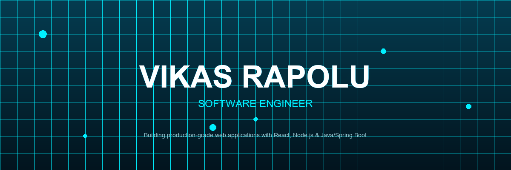
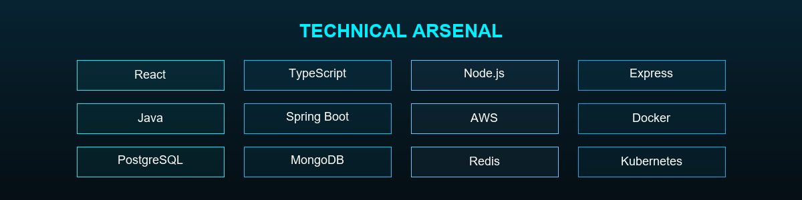

<div align="center">



</div>

<div align="center">

<!-- Typing Animation SVG -->
<svg width="700" height="40" viewBox="0 0 700 40" xmlns="http://www.w3.org/2000/svg">
  <text x="350" y="26" font-family="'Courier New', monospace" font-size="15" fill="#00f0ff" text-anchor="middle">
    Building production-grade web applications with React, Node.js &amp; Java/Spring Boot
    <animate attributeName="opacity" values="1;0.6;1" dur="2.5s" repeatCount="indefinite" />
  </text>
</svg>

</div>

---

## 🎯 About Me

```
┌─────────────────────────────────────────────────────────────┐
│  👨‍💻  Full-Stack Software Engineer                          │
│  🎓  M.S. Computer Science, Rowan University                 │
│  📍  New Jersey, USA                                         │
│  ⚡  4+ Years of Professional Experience                     │
└─────────────────────────────────────────────────────────────┘
```

> *"Transforming complex problems into elegant, scalable solutions. Passionate about distributed systems, 
> high-performance APIs, and cloud infrastructure that powers real-world applications."*

<br/>

<div align="center">



</div>

## 🛠️ Skill Levels

<div align="center">

<!-- Skill Bars SVG -->
<svg width="700" height="280" viewBox="0 0 700 280" xmlns="http://www.w3.org/2000/svg">
  <defs>
    <linearGradient id="skillGrad" x1="0%" y1="0%" x2="100%" y2="0%">
      <stop offset="0%" style="stop-color:#00f0ff" />
      <stop offset="100%" style="stop-color:#0080ff" />
    </linearGradient>
  </defs>

  <!-- Background Panel -->
  <rect x="20" y="10" width="660" height="260" rx="12" fill="rgba(0,240,255,0.03)" stroke="rgba(0,240,255,0.1)" stroke-width="1" />

  <!-- Title -->
  <text x="350" y="40" font-family="system-ui" font-size="16" fill="#00f0ff" text-anchor="middle" font-weight="600">SKILL LEVELS</text>

  <!-- React -->
  <text x="50" y="75" font-family="system-ui" font-size="12" fill="#ffffff" font-weight="500">React & TypeScript</text>
  <rect x="50" y="82" width="600" height="8" rx="4" fill="rgba(255,255,255,0.05)" />
  <rect x="50" y="82" width="0" height="8" rx="4" fill="url(#skillGrad)">
    <animate attributeName="width" from="0" to="540" dur="1.5s" fill="freeze" />
  </rect>
  <text x="600" y="75" font-family="system-ui" font-size="11" fill="#00f0ff" text-anchor="end">90%</text>

  <!-- Node.js -->
  <text x="50" y="115" font-family="system-ui" font-size="12" fill="#ffffff" font-weight="500">Node.js & Express</text>
  <rect x="50" y="122" width="600" height="8" rx="4" fill="rgba(255,255,255,0.05)" />
  <rect x="50" y="122" width="0" height="8" rx="4" fill="url(#skillGrad)">
    <animate attributeName="width" from="0" to="510" dur="1.5s" begin="0.2s" fill="freeze" />
  </rect>
  <text x="570" y="115" font-family="system-ui" font-size="11" fill="#00f0ff" text-anchor="end">85%</text>

  <!-- Java/Spring -->
  <text x="50" y="155" font-family="system-ui" font-size="12" fill="#ffffff" font-weight="500">Java / Spring Boot</text>
  <rect x="50" y="162" width="600" height="8" rx="4" fill="rgba(255,255,255,0.05)" />
  <rect x="50" y="162" width="0" height="8" rx="4" fill="url(#skillGrad)">
    <animate attributeName="width" from="0" to="480" dur="1.5s" begin="0.4s" fill="freeze" />
  </rect>
  <text x="540" y="155" font-family="system-ui" font-size="11" fill="#00f0ff" text-anchor="end">80%</text>

  <!-- AWS/Cloud -->
  <text x="50" y="195" font-family="system-ui" font-size="12" fill="#ffffff" font-weight="500">AWS & Cloud Infrastructure</text>
  <rect x="50" y="202" width="600" height="8" rx="4" fill="rgba(255,255,255,0.05)" />
  <rect x="50" y="202" width="0" height="8" rx="4" fill="url(#skillGrad)">
    <animate attributeName="width" from="0" to="450" dur="1.5s" begin="0.6s" fill="freeze" />
  </rect>
  <text x="510" y="195" font-family="system-ui" font-size="11" fill="#00f0ff" text-anchor="end">75%</text>

  <!-- Databases -->
  <text x="50" y="235" font-family="system-ui" font-size="12" fill="#ffffff" font-weight="500">PostgreSQL, MongoDB, Redis</text>
  <rect x="50" y="242" width="600" height="8" rx="4" fill="rgba(255,255,255,0.05)" />
  <rect x="50" y="242" width="0" height="8" rx="4" fill="url(#skillGrad)">
    <animate attributeName="width" from="0" to="480" dur="1.5s" begin="0.8s" fill="freeze" />
  </rect>
  <text x="540" y="235" font-family="system-ui" font-size="11" fill="#00f0ff" text-anchor="end">80%</text>
</svg>

</div>

## 💼 Professional Experience

<div align="center">

<table>
  <tr>
    <td width="50%">
      <h3 align="center">🏢 Cisco Systems</h3>
      <p align="center"><em>Software Engineer | Jun 2024 - Present</em></p>
      <ul>
        <li>⚡ Reduced API response time from ~600ms to ~220ms via Redis caching</li>
        <li>🧩 Built React + TypeScript component library adopted by 4 teams</li>
        <li>☁️ Architected event-driven AWS workflows saving 20+ hrs/week</li>
        <li>🚀 Raised deployment frequency from weekly to on-demand</li>
      </ul>
    </td>
    <td width="50%">
      <h3 align="center">🏢 Hexaware Technologies</h3>
      <p align="center"><em>Software Engineer | Jul 2021 - Aug 2022</em></p>
      <ul>
        <li>📈 Improved Lighthouse scores from ~55 to ~90 on migration project</li>
        <li>🧪 Raised backend test coverage from ~40% to ~80%</li>
        <li>👥 Delivered features used by 10,000+ end users daily</li>
        <li>🏆 Received internal Spot Award for critical reporting feature</li>
      </ul>
    </td>
  </tr>
</table>

</div>

## 🚀 Featured Projects

<div align="center">

<!-- Project Cards with SVG Borders -->
<svg width="100%" height="420" viewBox="0 0 900 420" xmlns="http://www.w3.org/2000/svg">
  <defs>
    <linearGradient id="cardGrad1" x1="0%" y1="0%" x2="100%" y2="100%">
      <stop offset="0%" style="stop-color:rgba(0,240,255,0.15)" />
      <stop offset="100%" style="stop-color:rgba(0,128,255,0.05)" />
    </linearGradient>
    <linearGradient id="cardGrad2" x1="0%" y1="0%" x2="100%" y2="100%">
      <stop offset="0%" style="stop-color:rgba(0,128,255,0.15)" />
      <stop offset="100%" style="stop-color:rgba(0,240,255,0.05)" />
    </linearGradient>
    <linearGradient id="cardGrad3" x1="0%" y1="0%" x2="100%" y2="100%">
      <stop offset="0%" style="stop-color:rgba(0,240,255,0.1)" />
      <stop offset="100%" style="stop-color:rgba(128,0,255,0.05)" />
    </linearGradient>
  </defs>

  <!-- Card 1: TaskFlow -->
  <rect x="20" y="20" width="270" height="380" rx="16" fill="url(#cardGrad1)" stroke="rgba(0,240,255,0.2)" stroke-width="1" />
  <rect x="35" y="40" width="240" height="140" rx="8" fill="rgba(0,240,255,0.05)" />
  <text x="155" y="110" font-family="system-ui" font-size="14" fill="#00f0ff" text-anchor="middle" font-weight="600">🔄 TaskFlow Platform</text>
  <text x="40" y="210" font-family="system-ui" font-size="11" fill="#ffffff" font-weight="600">React, Node.js, Express, PostgreSQL, AWS</text>
  <text x="40" y="240" font-family="system-ui" font-size="11" fill="rgba(255,255,255,0.7)">
    <tspan x="40" dy="0">Multi-tenant task management web</tspan>
    <tspan x="40" dy="18">app with JWT auth, role-based</tspan>
    <tspan x="40" dy="18">access control, and real-time</tspan>
    <tspan x="40" dy="18">WebSocket updates.</tspan>
  </text>
  <text x="40" y="330" font-family="system-ui" font-size="10" fill="#00f0ff">✦ Achieved 95+ Lighthouse score</text>

  <!-- Card 2: DevInsights -->
  <rect x="315" y="20" width="270" height="380" rx="16" fill="url(#cardGrad2)" stroke="rgba(0,128,255,0.2)" stroke-width="1" />
  <rect x="330" y="40" width="240" height="140" rx="8" fill="rgba(0,128,255,0.05)" />
  <text x="450" y="110" font-family="system-ui" font-size="14" fill="#0080ff" text-anchor="middle" font-weight="600">📊 DevInsights Dashboard</text>
  <text x="335" y="210" font-family="system-ui" font-size="11" fill="#ffffff" font-weight="600">Next.js, TypeScript, Spring Boot, MongoDB</text>
  <text x="335" y="240" font-family="system-ui" font-size="11" fill="rgba(255,255,255,0.7)">
    <tspan x="335" dy="0">Developer analytics dashboard</tspan>
    <tspan x="335" dy="18">ingesting Git activity from GitHub</tspan>
    <tspan x="335" dy="18">APIs, visualizing PR throughput</tspan>
    <tspan x="335" dy="18">and review latency.</tspan>
  </text>
  <text x="335" y="330" font-family="system-ui" font-size="10" fill="#0080ff">✦ Real-time data visualization</text>

  <!-- Card 3: Cloud Migration -->
  <rect x="610" y="20" width="270" height="380" rx="16" fill="url(#cardGrad3)" stroke="rgba(0,240,255,0.15)" stroke-width="1" />
  <rect x="625" y="40" width="240" height="140" rx="8" fill="rgba(0,240,255,0.03)" />
  <text x="745" y="110" font-family="system-ui" font-size="14" fill="#00f0ff" text-anchor="middle" font-weight="600">☁️ Cloud Migration Suite</text>
  <text x="630" y="210" font-family="system-ui" font-size="11" fill="#ffffff" font-weight="600">Java, Spring Boot, React, AWS, Docker</text>
  <text x="630" y="240" font-family="system-ui" font-size="11" fill="rgba(255,255,255,0.7)">
    <tspan x="630" dy="0">Enterprise cloud migration tooling</tspan>
    <tspan x="630" dy="18">reducing API response times by 63%,</tspan>
    <tspan x="630" dy="18">with automated CI/CD pipelines</tspan>
    <tspan x="630" dy="18">and monitoring dashboards.</tspan>
  </text>
  <text x="630" y="330" font-family="system-ui" font-size="10" fill="#00f0ff">✦ 63% performance improvement</text>
</svg>

</div>

## 📊 GitHub Stats

<div align="center">

<!-- Animated Stats Grid -->
<svg width="700" height="200" viewBox="0 0 700 200" xmlns="http://www.w3.org/2000/svg">
  <defs>
    <linearGradient id="statGrad" x1="0%" y1="0%" x2="100%" y2="100%">
      <stop offset="0%" style="stop-color:rgba(0,240,255,0.2)" />
      <stop offset="100%" style="stop-color:rgba(0,128,255,0.1)" />
    </linearGradient>
  </defs>

  <!-- Stat 1 -->
  <rect x="20" y="20" width="200" height="160" rx="12" fill="url(#statGrad)" stroke="rgba(0,240,255,0.15)" />
  <text x="120" y="70" font-family="system-ui" font-size="36" fill="#00f0ff" text-anchor="middle" font-weight="700">
    4+
    <animate attributeName="opacity" values="0.5;1;0.5" dur="3s" repeatCount="indefinite" />
  </text>
  <text x="120" y="100" font-family="system-ui" font-size="12" fill="rgba(255,255,255,0.6)" text-anchor="middle">Years Experience</text>

  <!-- Stat 2 -->
  <rect x="250" y="20" width="200" height="160" rx="12" fill="url(#statGrad)" stroke="rgba(0,240,255,0.15)" />
  <text x="350" y="70" font-family="system-ui" font-size="36" fill="#00f0ff" text-anchor="middle" font-weight="700">
    10K+
    <animate attributeName="opacity" values="0.5;1;0.5" dur="3s" begin="0.5s" repeatCount="indefinite" />
  </text>
  <text x="350" y="100" font-family="system-ui" font-size="12" fill="rgba(255,255,255,0.6)" text-anchor="middle">Daily Users Served</text>

  <!-- Stat 3 -->
  <rect x="480" y="20" width="200" height="160" rx="12" fill="url(#statGrad)" stroke="rgba(0,240,255,0.15)" />
  <text x="580" y="70" font-family="system-ui" font-size="36" fill="#00f0ff" text-anchor="middle" font-weight="700">
    63%
    <animate attributeName="opacity" values="0.5;1;0.5" dur="3s" begin="1s" repeatCount="indefinite" />
  </text>
  <text x="580" y="100" font-family="system-ui" font-size="12" fill="rgba(255,255,255,0.6)" text-anchor="middle">API Improvement</text>

  <!-- Decorative connecting lines -->
  <line x1="220" y1="100" x2="250" y2="100" stroke="rgba(0,240,255,0.2)" stroke-width="1" stroke-dasharray="4,4">
    <animate attributeName="stroke-dashoffset" values="0;8" dur="1s" repeatCount="indefinite" />
  </line>
  <line x1="450" y1="100" x2="480" y2="100" stroke="rgba(0,240,255,0.2)" stroke-width="1" stroke-dasharray="4,4">
    <animate attributeName="stroke-dashoffset" values="0;8" dur="1s" repeatCount="indefinite" />
  </line>
</svg>

</div>

## 🎓 Education

<div align="center">

| Degree | Institution | Period |
|:------:|:-----------:|:------:|
| 🎓 **M.S. Computer Science** | Rowan University, NJ | Sep 2022 - May 2024 |
| 🎓 **B.Tech Electronics & Communication** | Lovely Professional University, India | Aug 2017 - May 2021 |

</div>

---

<div align="center">

<!-- Animated Footer -->
<svg width="100%" height="120" viewBox="0 0 800 120" xmlns="http://www.w3.org/2000/svg">
  <defs>
    <linearGradient id="footerGrad" x1="0%" y1="0%" x2="100%" y2="0%">
      <stop offset="0%" style="stop-color:transparent" />
      <stop offset="50%" style="stop-color:#00f0ff;stop-opacity:0.5" />
      <stop offset="100%" style="stop-color:transparent" />
    </linearGradient>
    <filter id="glow" x="-50%" y="-50%" width="200%" height="200%">
      <feGaussianBlur stdDeviation="3" result="coloredBlur"/>
      <feMerge>
        <feMergeNode in="coloredBlur"/>
        <feMergeNode in="SourceGraphic"/>
      </feMerge>
    </filter>
  </defs>

  <!-- Top Line -->
  <line x1="100" y1="20" x2="700" y2="20" stroke="url(#footerGrad)" stroke-width="1" />

  <!-- Contact Text -->
  <text x="400" y="55" font-family="system-ui" font-size="20" fill="#00f0ff" text-anchor="middle" font-weight="600" filter="url(#glow)">
    Let's Build Something Amazing Together
  </text>

  <text x="400" y="80" font-family="system-ui" font-size="12" fill="rgba(255,255,255,0.5)" text-anchor="middle">
    📧 vikasvicky514@gmail.com | Open to opportunities & collaborations
  </text>

  <!-- Animated Pulsing Dots -->
  <circle cx="350" cy="100" r="4" fill="#00f0ff">
    <animate attributeName="r" values="4;6;4" dur="2s" repeatCount="indefinite" />
    <animate attributeName="opacity" values="1;0.5;1" dur="2s" repeatCount="indefinite" />
  </circle>
  <circle cx="400" cy="100" r="4" fill="#00f0ff">
    <animate attributeName="r" values="4;6;4" dur="2s" begin="0.3s" repeatCount="indefinite" />
    <animate attributeName="opacity" values="1;0.5;1" dur="2s" begin="0.3s" repeatCount="indefinite" />
  </circle>
  <circle cx="450" cy="100" r="4" fill="#00f0ff">
    <animate attributeName="r" values="4;6;4" dur="2s" begin="0.6s" repeatCount="indefinite" />
    <animate attributeName="opacity" values="1;0.5;1" dur="2s" begin="0.6s" repeatCount="indefinite" />
  </circle>

  <!-- Bottom Line -->
  <line x1="100" y1="115" x2="700" y2="115" stroke="url(#footerGrad)" stroke-width="1" />
</svg>

<br/>

**© 2024 Vikas Rapolu. All rights reserved.**

*Built with React, Three.js, and passion.* 🚀

</div>
